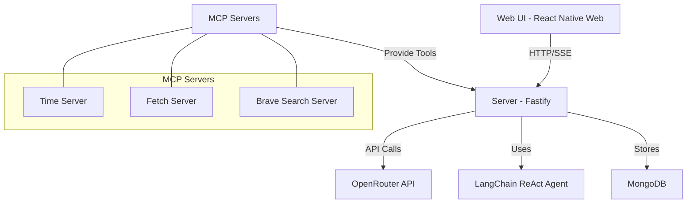

# AI Agent Chat Service

A full-stack application for AI agent chat with real-time streaming responses using LangChain's ReAct agent and Server-Sent Events (SSE).


## Features

- **Real-time Streaming Responses**: See the AI's thinking process and responses as they're generated
- **ReAct Agent Integration**: Utilizes LangChain's ReAct agent for reasoning and action capabilities
- **Tool Integration**: Includes tools for web search, fetching content, and more
- **Session Management**: Create and manage multiple chat sessions
- **Model Selection**: Choose from different language models
- **Responsive UI**: Works on desktop and mobile devices
- **Docker Containerization**: Easy deployment with Docker Compose

## Quick Start

### Prerequisites

- Docker and Docker Compose
- OpenRouter API key (or other LLM provider)
- Brave API key (for web search tool)

### Installation

1. Clone the repository:
   ```bash
   git clone https://github.com/yourusername/ai-agent-chat.git
   cd ai-agent-chat
   ```

2. Create a `.env` file in the root directory:
   ```
   OPENROUTER_API_KEY=your_openrouter_api_key
   BRAVE_API_KEY=your_brave_api_key
   ```

3. Build and start the containers:
   ```bash
   docker-compose up -d
   ```

4. Access the application at http://localhost:3000

## Documentation

Comprehensive documentation is available in the `docs` directory:

- [User Guide](docs/user-guide.md) - Instructions for using the application
- [Developer Guide](docs/developer-guide.md) - Guide for developers working on the project
- [API Reference](docs/api-reference.md) - Detailed API documentation
- [Documentation Index](docs/index.md) - Overview of all documentation

## Architecture

The application consists of the following components:



## Project Structure

```
.
├── docker-compose.yaml       # Docker Compose configuration
├── README.md                 # Project overview
├── docs/                     # Documentation
├── src/
│   ├── common/               # Shared code between server and web-ui
│   │   ├── components/       # Shared React components
│   │   ├── types/            # TypeScript type definitions
│   │   └── utils/            # Utility functions
│   └── containers/
│       ├── server/           # Backend server
│       │   ├── src/          # Server source code
│       │   ├── Dockerfile
│       │   └── package.json
│       └── web-ui/           # Frontend application
│           ├── src/          # Web UI source code
│           ├── Dockerfile
│           └── package.json
```

## Development

### Local Development

#### Server

```bash
cd src/containers/server
npm install
npm run dev
```

#### Web UI

```bash
cd src/containers/web-ui
npm install
npm start
```

## Contributing

Contributions are welcome! Please feel free to submit a Pull Request.

## License

This project is licensed under the MIT License - see the LICENSE file for details.
