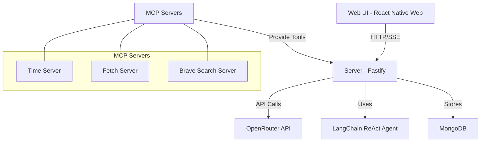

# AI Agent Chat Service Developer Guide

This guide provides comprehensive documentation for developers working on the AI Agent Chat Service. It covers the architecture, components, setup instructions, and development workflows.

## Table of Contents

1. [Architecture Overview](#architecture-overview)
2. [Project Structure](#project-structure)
3. [Setup and Installation](#setup-and-installation)
4. [Core Components](#core-components)
   - [Common Layer](#common-layer)
   - [Server](#server)
   - [Web UI](#web-ui)
   - [Tool Services](#tool-services)
5. [Development Workflows](#development-workflows)
6. [API Reference](#api-reference)
7. [Testing](#testing)
8. [Deployment](#deployment)
9. [Extending the Application](#extending-the-application)
10. [Troubleshooting](#troubleshooting)

## Architecture Overview

The AI Agent Chat Service is a full-stack application that enables users to interact with AI agents powered by LangChain's ReAct framework. The application uses Server-Sent Events (SSE) for real-time streaming of AI responses, including intermediate thinking steps.

### Key Components



- **Web UI**: React Native Web application with Expo
- **Server**: Fastify-based Node.js server with LangChain integration
- **Database**: MongoDB for storing chat sessions and messages
- **Tool Services**: Microservices for various agent tools (time, web search, web fetch)

### Data Flow

1. User sends a message through the Web UI
2. Server receives the message and initiates a LangChain ReAct agent
3. The agent processes the message, potentially using various tools
4. Server streams the agent's thinking process and final response back to the Web UI using SSE
5. Web UI displays the streaming response to the user
6. Chat history is stored in MongoDB for persistence

## Project Structure

```
.
├── docker-compose.yaml       # Docker Compose configuration
├── README.md                 # Project overview
├── docs/                     # Documentation
│   └── developer-guide.md    # This guide
├── src/
│   ├── common/               # Shared code between server and web-ui
│   │   ├── components/       # Shared React components
│   │   ├── types/            # TypeScript type definitions
│   │   └── utils/            # Utility functions
│   └── containers/
│       ├── server/           # Backend server
│       │   ├── src/
│       │   │   ├── config/   # Server configuration
│       │   │   ├── controllers/ # Request handlers
│       │   │   ├── routes/   # API routes
│       │   │   ├── services/ # Business logic
│       │   │   └── index.ts  # Entry point
│       │   ├── Dockerfile
│       │   └── package.json
│       └── web-ui/           # Frontend application
│           ├── src/
│           │   ├── components/ # UI components
│           │   ├── hooks/    # Custom React hooks
│           │   ├── screens/  # Screen components
│           │   ├── services/ # API services
│           │   └── utils/    # Utility functions
│           ├── Dockerfile
│           └── package.json
```

## Setup and Installation

### Prerequisites

- Docker and Docker Compose
- Node.js 18+ (for local development)
- OpenRouter API key (or other LLM provider)
- Brave API key (for web search tool)

### Environment Setup

1. Clone the repository:
   ```bash
   git clone https://github.com/yourusername/ai-agent-chat.git
   cd ai-agent-chat
   ```

2. Create a `.env` file in the root directory:
   ```
   OPENROUTER_API_KEY=your_openrouter_api_key
   BRAVE_API_KEY=your_brave_api_key
   ```

### Running with Docker Compose

1. Build and start the containers:
   ```bash
   docker-compose up -d
   ```

2. Access the application at http://localhost:3000

### Local Development Setup

#### Server

1. Navigate to the server directory:
   ```bash
   cd src/containers/server
   ```

2. Install dependencies:
   ```bash
   npm install
   ```

3. Create a `.env` file based on `.env.example`

4. Start the development server:
   ```bash
   npm run dev
   ```

#### Web UI

1. Navigate to the web UI directory:
   ```bash
   cd src/containers/web-ui
   ```

2. Install dependencies:
   ```bash
   npm install
   ```

3. Start the development server:
   ```bash
   npm start
   ```

## Core Components

### Common Layer

The common layer contains shared code between the server and web UI.

#### Types

Located in `src/common/types/index.ts`, these TypeScript interfaces define the core data structures:

- `Message`: Represents a single message in a chat
- `ChatSession`: Represents a chat session with messages
- `LLMModel`: Represents an LLM model configuration
- `ChatRequest`/`ChatResponse`: Request/response payloads for chat API
- `SSEEvent`: Server-Sent Event structure
- `AgentAction`/`AgentFinish`: ReAct agent action types

#### Utilities

- `yaml.ts`: Functions for converting between chat sessions and YAML format
- `date.ts`: Date formatting utilities
- `index.ts`: General utilities like ID generation and string manipulation

### Server

The server is a Fastify-based Node.js application that handles API requests, manages the LangChain ReAct agent, and streams responses using SSE.

#### Key Files

- `src/containers/server/src/index.ts`: Entry point that sets up the Fastify server
- `src/containers/server/src/routes/`: API route definitions
- `src/containers/server/src/controllers/`: Request handlers
- `src/containers/server/src/services/`: Business logic
  - `tool.service.ts`: Defines tools for the ReAct agent
  - `session.service.ts`: Manages chat sessions
  - `model.service.ts`: Manages LLM models

#### API Routes

- `POST /api/chat`: Send a message to the AI agent (SSE endpoint)
- `GET /api/models`: Get available language models
- `GET /api/sessions`: Get all chat sessions
- `POST /api/sessions`: Create a new chat session
- `GET /api/sessions/:id`: Get a specific chat session
- `PUT /api/sessions/:id`: Update a chat session
- `DELETE /api/sessions/:id`: Delete a chat session
- `GET /api/history`: Export chat history
- `POST /api/history/import`: Import chat history

#### ReAct Agent Implementation

The ReAct agent is implemented in `src/containers/server/src/controllers/chat.controller.ts`. It uses LangChain's `createReactAgent` function to create an agent that can use various tools to accomplish tasks.

The agent's thinking process and final response are streamed back to the client using SSE, allowing the user to see the agent's reasoning in real-time.

#### Tools

The ReAct agent has access to several tools defined in `src/containers/server/src/services/tool.service.ts`:

- `current-time`: Get the current time and date
- `web-search`: Search the web for information using Brave Search
- `web-fetch`: Fetch content from a URL
- `calculator`: Perform mathematical calculations

### Web UI

The web UI is a React Native Web application built with Expo. It provides a chat interface for interacting with the AI agent.

#### Key Files

- `src/containers/web-ui/App.tsx`: Main application component
- `src/containers/web-ui/src/screens/ChatScreen.tsx`: Main chat screen
- `src/containers/web-ui/src/components/`: UI components
- `src/containers/web-ui/src/hooks/`: Custom React hooks
  - `useSession.tsx`: Hook for managing chat sessions
  - `useModel.tsx`: Hook for managing LLM models
- `src/containers/web-ui/src/services/api.ts`: API client for communicating with the server

#### Components

- `ChatHeader`: Header component with title and menu button
- `ChatMessages`: Component for displaying chat messages
- `ChatInput`: Input component for sending messages
- `SessionSidebar`: Sidebar for managing chat sessions
- `ModelSelector`: Component for selecting LLM models
- `ThinkingIndicator`: Component for displaying the agent's thinking process

#### SSE Implementation

The web UI uses the `EventSource` API to establish an SSE connection with the server. This is implemented in `src/containers/web-ui/src/services/api.ts`.

The `sendChatMessage` function creates an SSE connection and handles the different event types:

- `message`: Final response from the agent
- `thinking`: Intermediate thinking steps
- `error`: Error messages
- `done`: Signal that the response is complete

### Tool Services

The tool services are microservices that provide functionality to the ReAct agent. They are implemented as Docker containers and are accessed by the server via HTTP.

- `time`: Provides current time and date information
- `brave-search`: Searches the web using Brave Search
- `fetch`: Fetches content from URLs

## Development Workflows

### Adding a New Feature

1. Identify which part of the application needs to be modified (common, server, or web-ui)
2. Make the necessary changes to the code
3. Test the changes locally
4. Update documentation if needed
5. Submit a pull request

### Adding a New Tool

1. Add a new tool service to the `docker-compose.yaml` file
2. Implement the tool in `src/containers/server/src/services/tool.service.ts`
3. Test the tool with the ReAct agent
4. Update documentation

### Adding a New API Endpoint

1. Create a new route file in `src/containers/server/src/routes/`
2. Implement the route handler in `src/containers/server/src/controllers/`
3. Register the route in `src/containers/server/src/routes/index.ts`
4. Add the corresponding API client function in `src/containers/web-ui/src/services/api.ts`
5. Test the endpoint

## API Reference

### Chat API

#### `POST /api/chat`

Send a message to the AI agent and receive a streaming response.

**Request Body:**
```json
{
  "sessionId": "string",
  "message": "string",
  "modelId": "string"
}
```

**Response:**
Server-Sent Events with the following event types:
- `message`: Final response from the agent
- `thinking`: Intermediate thinking steps
- `error`: Error messages
- `done`: Signal that the response is complete

### Sessions API

#### `GET /api/sessions`

Get all chat sessions.

**Response:**
```json
[
  {
    "id": "string",
    "title": "string",
    "messages": [
      {
        "id": "string",
        "role": "user | assistant | system",
        "content": "string",
        "timestamp": "string"
      }
    ],
    "createdAt": "string",
    "updatedAt": "string",
    "modelId": "string"
  }
]
```

#### `POST /api/sessions`

Create a new chat session.

**Request Body:**
```json
{
  "title": "string (optional)",
  "modelId": "string"
}
```

**Response:**
```json
{
  "id": "string",
  "title": "string",
  "messages": [],
  "createdAt": "string",
  "updatedAt": "string",
  "modelId": "string"
}
```

#### `GET /api/sessions/:id`

Get a specific chat session.

**Response:**
```json
{
  "id": "string",
  "title": "string",
  "messages": [
    {
      "id": "string",
      "role": "user | assistant | system",
      "content": "string",
      "timestamp": "string"
    }
  ],
  "createdAt": "string",
  "updatedAt": "string",
  "modelId": "string"
}
```

#### `PUT /api/sessions/:id`

Update a chat session.

**Request Body:**
```json
{
  "title": "string (optional)",
  "modelId": "string (optional)"
}
```

**Response:**
```json
{
  "id": "string",
  "title": "string",
  "messages": [
    {
      "id": "string",
      "role": "user | assistant | system",
      "content": "string",
      "timestamp": "string"
    }
  ],
  "createdAt": "string",
  "updatedAt": "string",
  "modelId": "string"
}
```

#### `DELETE /api/sessions/:id`

Delete a chat session.

**Response:**
```json
{
  "success": true
}
```

### Models API

#### `GET /api/models`

Get available language models.

**Response:**
```json
[
  {
    "id": "string",
    "name": "string",
    "provider": "string",
    "description": "string (optional)"
  }
]
```

### History API

#### `GET /api/history/export`

Export chat history as YAML.

**Response:**
```json
{
  "yaml": "string"
}
```

#### `POST /api/history/import`

Import chat history from YAML.

**Request Body:**
```json
{
  "yamlContent": "string"
}
```

**Response:**
```json
{
  "success": true
}
```

## Testing

### Server Tests

Run server tests with:

```bash
cd src/containers/server
npm test
```

### Web UI Tests

Run web UI tests with:

```bash
cd src/containers/web-ui
npm test
```

## Deployment

### Docker Deployment

The application can be deployed using Docker Compose:

```bash
docker-compose up -d
```

### Manual Deployment

#### Server

1. Build the server:
   ```bash
   cd src/containers/server
   npm run build
   ```

2. Start the server:
   ```bash
   npm start
   ```

#### Web UI

1. Build the web UI:
   ```bash
   cd src/containers/web-ui
   npm run build
   ```

2. Serve the built files with a static file server.

## Extending the Application

### Adding a New Model Provider

1. Update the `src/containers/server/src/services/model.service.ts` file to include the new provider
2. Add the necessary API client code
3. Update the environment variables and configuration

### Adding a New Tool

1. Add a new tool to the `src/containers/server/src/services/tool.service.ts` file
2. Implement the tool's functionality
3. Test the tool with the ReAct agent

### Adding a New UI Component

1. Create a new component in `src/containers/web-ui/src/components/`
2. Import and use the component in the appropriate screen or parent component
3. Style the component using React Native StyleSheet

## Troubleshooting

### Common Issues

#### Server Won't Start

- Check if MongoDB is running
- Verify that the required environment variables are set
- Check the server logs for error messages

#### Web UI Won't Connect to Server

- Verify that the server is running
- Check the CORS configuration in the server
- Verify that the API URL is correct in the web UI

#### ReAct Agent Not Working

- Check if the OpenRouter API key is valid
- Verify that the tool services are running
- Check the server logs for error messages

### Debugging

#### Server

- Use the `--inspect` flag with Node.js to enable debugging
- Check the server logs for error messages
- Use `console.log` statements to debug specific issues

#### Web UI

- Use the React Developer Tools browser extension
- Check the browser console for error messages
- Use `console.log` statements to debug specific issues

---

This developer guide provides a comprehensive overview of the AI Agent Chat Service. For more information, refer to the code documentation and comments in the source files.
