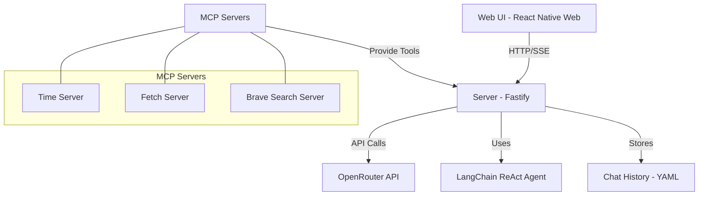

# Full packed AI Agent Chat service including web-ui and server.

## source directory structure

### `src/server`

### `src/web-ui`

### `src/common`

## PRD of MVP version

### Core functionalities
1. User can switch between different LLMs.
    - Button is placed on the right top corner of the SPA.
    - When clicked, a dropdown menu will be shown.
    - The menu contains all the LLMs that the server provides (using Openrouter API).
    - Chat history is not cleared when a new LLM is selected because the chat content itself is not related to LLM instance.

2. User can create new chat sessions and switch between them.
    - this feature is provided by pane and is placed on the left beside the chat ui.
    - pane is a component that contains all the chat sessions.
    - when a new chat session is created, a new chat history will be created and the chat ui will be updated with the new chat history.
    - when a chat session is switched, the chat ui will be updated with the switched chat history.

3. User can send messages to the LLM.
    - user can send messages to the LLM by typing in the chat ui and clicking the send button or pressing `Ctrl+Enter`.

4. Server returns the response of the LLM in a stream.
    - the response will be displayed in the chat ui in a stream.

5. Assume single user uses the service at a time in MVP version.
    - So, the chat history is stored in the server side.

6. User can download and import the chat history.
    - the chat history can be downloaded in proper yaml format.
    - the chat history can be imported by pasting the yaml content in the chat ui, so saved data must contains enough information to reconstruct the chat history.

7. AI agent implementation
    - Use langchain and langchain ReAct agent implementation.
    - Use Openrouter to call different LLMs.
    - If user's request is complex and LLM instance needs multiple steps to complete the task, server execute the steps until LLM instance determins the the task is complete and generates the final response.
    - server needs to return the intermediate results to the web-ui using server-sent events (SSE) so that the web-ui can display the intermediate results to the user.

8. Web UI
    - Use React Native Web and Expo.
    - Use React Native Resuable. This is universal shadcn/ui for React Native.
    - Example installation code: `npx @react-native-reusables/cli@latest add button` when you want to use button component.
    - Dark/Light theme is automatically applied according to the system setting in React Native.

9. Server
    - Use Fastify.
    - Use Openrouter to call different LLMs.
    - Use langchain and langchain ReAct agent implementation.
    - Use server-sent events (SSE) to return the (final or intermediate) response of the LLM in a stream.
    - Store chat history in the server side in proper YAML format.
    - Provide API for web-ui to chat, change LLM instance, download and import chat history.

10. Entire structure of the project
    - See [src/containers/README.md](src/containers/README.md)
    - Please implement all the features in all README.md files.
    - Implement proper docker compose file to run all the containers.

### Doc

### Implementation Plan

## System Architecture

## Implementation Plan

### 1. Common Components and Types (src/common)

First, we'll establish the shared foundation:

- **Types**: Define TypeScript interfaces for messages, chat sessions, LLM configurations
- **Utils**: Create utility functions for YAML parsing/generation, date formatting
- **Components**: Implement shared UI components if needed

### 2. Server Implementation (src/containers/server)

We'll build a Fastify server with the following features:

- **LangChain Integration**: Set up ReAct agent with tool definitions
- **OpenRouter API**: Implement client for accessing different LLMs
- **SSE Implementation**: Create endpoints that stream responses
- **Chat History Management**: Store and retrieve chat sessions in YAML format
- **API Endpoints**:
  - `/api/chat`: Send messages and receive streaming responses
  - `/api/models`: List available LLM models
  - `/api/sessions`: Manage chat sessions
  - `/api/history`: Download/import chat history

### 3. Web UI Implementation (src/containers/web-ui)

We'll develop a React Native Web application with:

- **Chat Interface**: Message display area with streaming support
- **Session Management**: Left sidebar for creating/switching chat sessions
- **LLM Selection**: Dropdown in top-right corner for switching models
- **History Management**: Import/export functionality for chat history
- **Responsive Design**: Mobile-friendly layout with dark/light theme support

### 4. Docker Configuration

We'll create:

- **Dockerfiles**: For both server and web-ui containers
- **docker-compose.yml**: Configuration for local deployment including MCP servers

## Technical Stack

- **Backend**:
  - Fastify (Node.js framework)
  - LangChain.js (for ReAct agent implementation)
  - OpenRouter API client
  - YAML parser/generator
  - TypeScript

- **Frontend**:
  - React Native Web
  - Expo
  - React Native Reusable (shadcn/ui)
  - TypeScript
  - SSE client

## Implementation Sequence

1. Set up project structure and common types
2. Implement basic server with Fastify
3. Add LangChain ReAct agent integration
4. Implement OpenRouter API client
5. Create SSE endpoints for streaming responses
6. Develop chat history management
7. Build basic web UI with React Native Web
8. Implement chat interface with streaming support
9. Add session management functionality
10. Integrate LLM selection
11. Implement history import/export
12. Create Docker configuration
13. Test and refine the entire system

### Additional features
